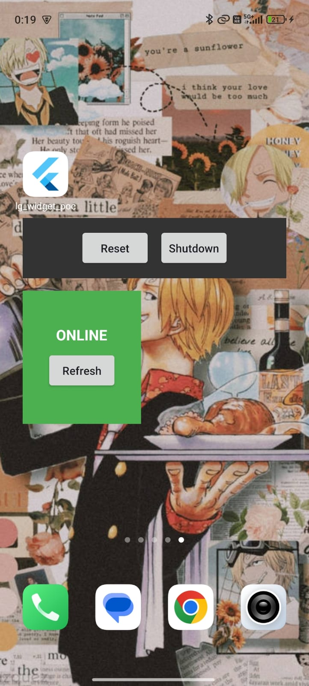
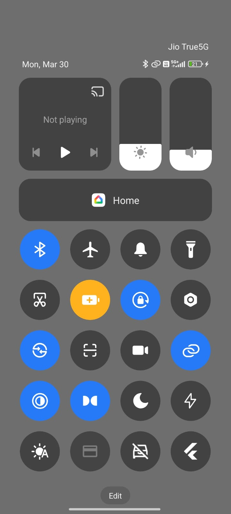

# LG Quick Control & Status Widgets - Proof of Concept

**Organization:** Liquid Galaxy  
**Program:** Google Summer of Code 2026  

## 📌 About This Repository
This repository contains a functional Proof of Concept (PoC) for the **LG Quick Control & Status Widgets** project. 

The primary goal of this PoC was to validate the highest-risk technical challenge of the project: **bridging native Android OS interactions (Home Screen Widgets and Quick Settings) directly to a headless Dart background isolate without waking the visual Flutter Engine.**

By proving this architecture works, the main 90-hour coding period can be safely dedicated to UI polish, robust SSH error handling, and comprehensive documentation.

## 🚀 Technical Validations Achieved
1. **Background Isolate Bridging:** Utilized the `home_widget` package to catch intents from native Android UI and trigger top-level Dart functions in the background.
2. **Native Android UI:** Built the foundational XML layouts for the 4x1 Command Bar and the 2x2 Live Status widgets.
3. **Quick Settings API Integration:** Developed a custom native Kotlin `TileService` that toggles states and broadcasts intents directly to Dart.
4. **SSH Execution & Shared Storage:** Integrated `dartssh2` to securely pull saved Master rig credentials from Android `SharedPreferences` and execute shell commands (e.g., `echo '' > /tmp/query.txt`) directly on the rig.

## 📸 Visual Proof
   

## 📂 Key Project Files
For mentors reviewing the code, the core logic mapping the Native-to-Flutter bridge can be found in these specific files:

* **The Dart Background Listener & SSH Logic:** * `lib/main.dart` (Contains the `@pragma('vm:entry-point')` callback)
  * `lib/lg_service.dart` (SSH execution logic)
* **The Native Kotlin Widget Providers:** * `android/app/src/main/kotlin/.../LgWidgetProvider.kt`
  * `android/app/src/main/kotlin/.../StatusWidgetProvider.kt`
* **The Native Quick Settings Tile:** * `android/app/src/main/kotlin/.../LgTileService.kt`
* **The Native XML Widget Layouts:** * `android/app/src/main/res/layout/`

## 🛠️ How to Run Locally
To test this PoC on a physical Android device:
1. Clone the repository.
2. Run `flutter pub get` to install dependencies.
3. Connect an Android device via USB Debugging.
4. Run `flutter run`.
5. Open the app once to save your LG Rig's IP/Credentials, then close the app.
6. Add the widgets to your home screen or pull down the notification shade to add the Quick Settings tile.
